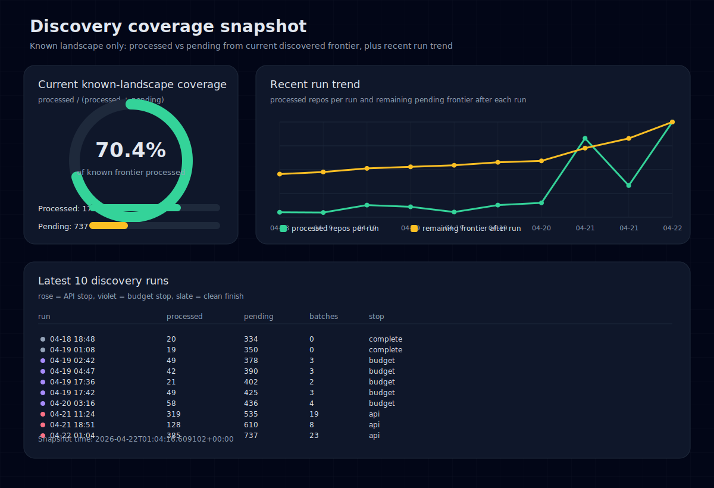

# Discovery Coverage

This page shows coverage of the currently known discovered landscape, not coverage of all of GitHub.

Current snapshot:
- processed repos: 1749
- pending repos: 737
- known discovered repos: 2486
- processed share of known discovered landscape: 70.4%
- snapshot generated from frontier timestamp: `2026-04-22T01:04:16.609102+00:00`

## How to read this

- The donut on the left shows `processed / (processed + pending)` for the current discovered frontier.
- The line chart on the right shows recent per-run throughput against remaining pending frontier.
- The run table at the bottom marks why runs stopped:
  - `api` means the run checkpointed on GitHub API pressure
  - `budget` means the run hit its configured time budget
  - `complete` means the run finished without either stop condition

## Important limitation

This is a graph of the known landscape that the current discovery system has already surfaced.
It is not a claim about total ecosystem coverage, because the total reachable or relevant landscape is still unknown and changing.
